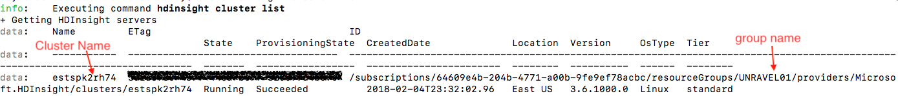

# unravel-autoscaling
This is a demo script to scale up or down cluster based on cluster cpu and memory usage
### Prerequisites
Install requests using pip:

`$ pip install requests`

Install Azure CLI 1.0 (Azure CLI 2.0 does not support HDinsight cluster) [Click Link to see installlation instruction](https://docs.microsoft.com/en-us/azure/cli-install-nodejs)

After install Azure CLI 1.0 Run the following command to login:

`$ azure login`

Once you login azure you should see existing HDinsight clusters using:

`$ azure hdinsight cluster list`

open `unravel_HDInsight_autoscaling.py` and edit these variables:

**unravel_base_url** e.g. 'http://localhost:3000'

**memory_threshold** e.g. 80; scale up/down when memory_usage higher/lower 80%

**cpu_threshold**  e.g. 10; scale up when cpu_usage higher/lower 10%             

**min_nodes**      e.g. 4; min worker nodes

**max_nodes**      e.g. 10; max worker nodes can scale up to

**resource_group** e.g. 'UNRAVEL01'

**cluster_name**   e.g. 'estspk2rh75'

cluster name and resource group name can be retrieved using azure command:

`$ azure hdinsight cluster list`

### Run auto scaling

Run the script:

`python unravel_HDInsight_autoscaling.py`
